# Crie seu projeto no GitHub

** Guia passo a passo **

## Conteúdo

- Criação de conta no GitHub
- Criação de repositório
- Tutorial simples sobre markdown
- Criação e upload de arquivos no GitHub
- Criando um diretório no GitHub
- Busca interna no editor do GitHub
- Criar chave SSH e publicar no GitHub
- Envio dos arquivos para o GitHub via Git
- Sincronizando seu projeto local com o repositório remoto:
    - Via linha de comando
    - Via GitHub Desktop
- Criando um novo release do projeto/repositório
- Excluindo um repositório
- Criando o composer.json com o composer
- Publicando seu projeto no Packagist
- Instalando seus projetos com o composer
- Outros recursos do GitHub


## Criação de conta no GitHub

Acesse

https://github.com/

Preencha o pequeno form no Sign up

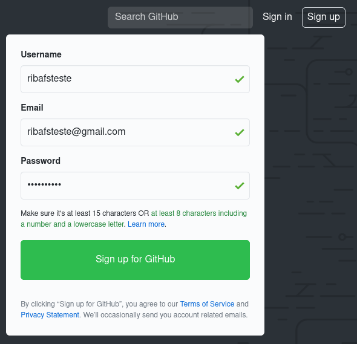


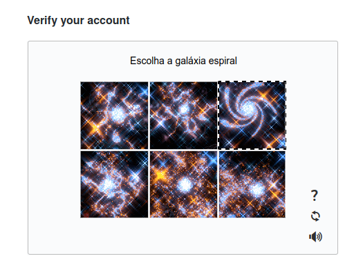

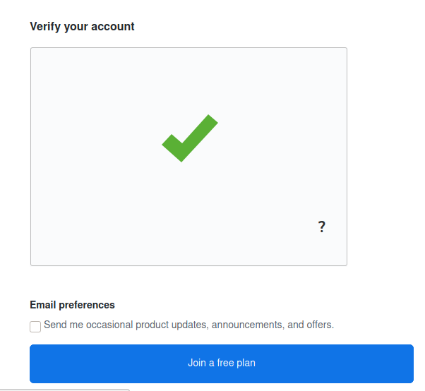


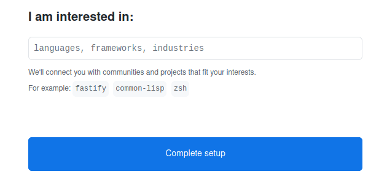

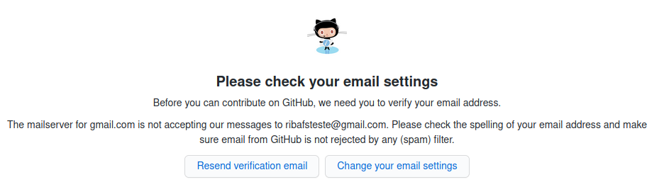


## Criação de repositório

Acessar o GitHub e efetuar login

Clique no botão verde New

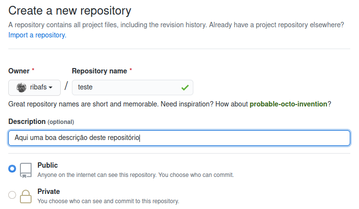

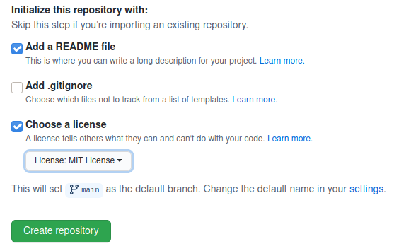

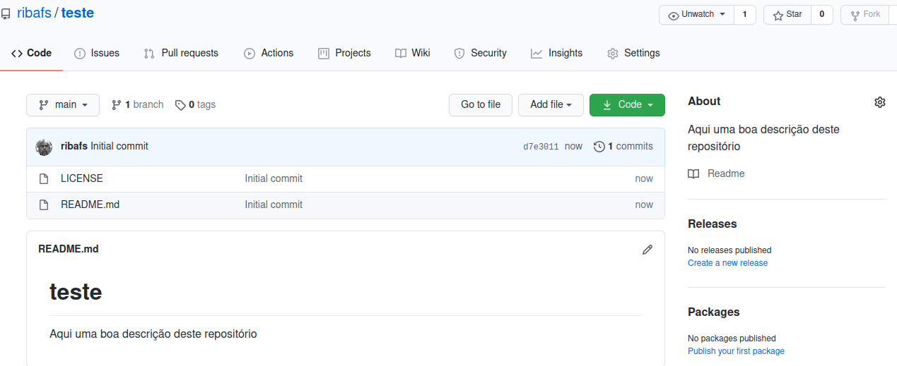


## Tutorial simples sobre markdown

O markdown é a linguagem de marcação adotada pelos documentos, especialmente no README.md, do GitHub.

É uma linguagem mais simples que o HTML. Dá menos trabalho criar uma página usando markdown que com HTML.


## Principais tags que utilizo para criar meus arquivos.


### Cabeçalhos/headers

```html
Usar de # até ###### para os cabeçalhos.

# Esta tag é como a <h1>
## Esta tag é como a <h2>
###### Esta tag é como a <h6>
```

### Sintaxe highlighting

Para colorir trechos de código conforme sua linguagem usamos

Três sinais (`) junto ao nome da linguagem. Existe suporte para várias linguagens:
- php
- html
- css
- javascript
- ruby
- bash
- etc

```php
    ```php
        public function index(Request $request)
        {
            $keyword = $request->get('search');
            $perPage = 2;
            if (!empty($keyword)) {
                $clientes = Cliente::where('nome', 'LIKE', "%$keyword%")
                    ->orWhere('email', 'LIKE', "%$keyword%")
                    ->latest()->paginate($perPage);
            } else {
                $clientes = Cliente::latest()->paginate($perPage);
            }
            return view('clientes.index', ["clientes" => $clientes]);
        }
    ```
```
Veja como o código acima fica

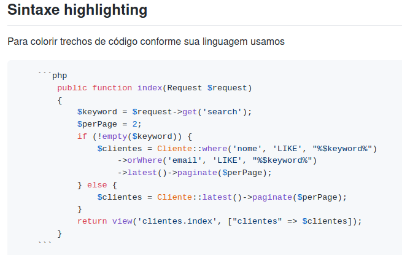

```javascript
    ```javascript
    function fancyAlert(arg) {
      if(arg) {
        $.facebox({div:'#foo'})
      }
    }
    ```
```

### URLs

Qualquer URL é automaticamente convertida em link, como

http://www.github.com

Mas podemos fazer isso explicitamente assim:

[GitHub](http://www.github.com)


## Mais detalhes aqui

https://guides.github.com/features/mastering-markdown/
https://docs.github.com/en/free-pro-team@latest/github/writing-on-github/basic-writing-and-formatting-syntax


## Criação e upload de arquivos no GitHub

Acesse o GitHub e abra o repositório desejado

Clique no botão Add file

- Create new file (Criar um novo arquivo)
- Upload files (Enviar arquivos)


### Criar um novo arquivo

Entrar com o nome do arquivo, geralmente com a extensão .md (não usar símbolo nem espaço).

Entrar com o conteúdo. Pode ser texto ou markdown. Não adianta criar com extensão html e conteúdo HTML, pois aparecerá como texto.

O GitHub somente aceita HTML, CSS e JavaScript em seus sites (GitHub Pages), abordado em outro item.

Ao final clique abaixo em Commit changes. Veja que pode entrar com uma mensagem de commit e uma descrição sobre o arquivo criado ou sobre as alerações.


### Enviando arquivos por upload

Após clicar Upload files:

- Podemos arrastar os arquivos do nosso gerenciador de arquivos para a textarea central
- Ou podemos clicar em "choose your files" para selecionar os arquivos do nosso computador a serem enviados.

Podemos enviar um único arquivo ou selecionar vários de uma vez, clicando no primeiro, segurando o Shift e clicando no último. Podemos usar o Ctrl para selecionar alternados.


## Criando um diretório no GitHub

Não é algo intuitivo, portanto seguem os passos:

Suponha que queira criar o arquivo README.md, mas dentro de um diretório que ainda não existe, o "Apostilas".

- Clicamos no botão Add file
- Create new file
- Digitamos "Apostilas" e em seguida teclamos na barra "/". Veja que agora abre espaço para digitarmos o nome do arquivo, então digitamos "README.md" e entramos com o conteúdo abaixo.

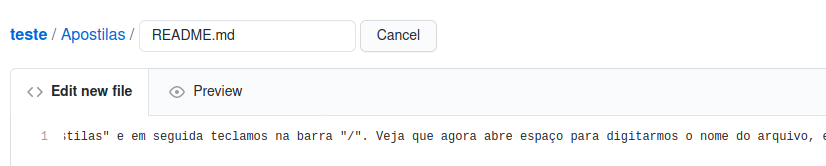


## Busca interna no editor do GitHub

### Editar um arquivo no site do GitHub

- Clique no nome do arquivo no repositório
- Clique no pequeno lapis à direita

Estando com o arquivo aberto no editor, então tecle Ctrl+F
Será aberta a caixa Search acima.
Digite o termo e  tecle enter


## Criar chave SSH e publicar no GitHub

Para enviar seus arquivos do desktop para o GitHub via git, precisa criar uma chave do SSH e cadastrar esta chave no GitHub.

### Criar a chave

Abra o terminal e digite
```bash
cd
ssh-keygen -t rsa -b 4096 -C "ribafs@gmail.com"
Enter
Enter
Enter

cat ~/.ssh/id_rsa.pub
```
Copie a chave mostrada desde ssh-rsa ... até seu e-mail, incluso.

Vá ate'o GitHub, faça login e clique acima em seu avatar e Settings
- SSH and GPG keys
- New SSH key

Entre com um Title

E cole na caixa Key abaixo

E clique em Add SSH key

Agora já pode enviar arquivos via git para seus repositórios.

Na primeira vez precisa enrar com suas credenciais, mas nas próximas não precisará:
```bash
git config --global user.name "Ribamar FS"
git config --global user.email "ribafs@gmail.com"
```

## Envio dos arquivos para o GitHub via Git

Agora que já enviamos a chave SSH, então veja como enviar os arquivos para um repositório.

Como capturar o endereço do seu repositório a ser usado nos envios com git?

- Abra o repositório
- Clique em Code
- Selecione o endereço abaixo em SSH. Exemplo: git@github.com:ribafs/teste.git e cole na linha git remote add origin...

### Enviar arquivos
```bash
git config --global user.name "Ribamar FS"
git config --global user.email "ribafs@gmail.com"
git init
git add .
git commit -m "Primeiro Commit"
git remote add origin git@github.com:ribafs/teste.git
git push origin master
```
Se houver alguuma falha, troque o último comando por este:
```bash
git push -f origin master
```

## Sincronizando seu projeto local com o repositório remoto:

### Via linha de comando

É uma beleza de simples fazer isso, mas faz muito tempo que procuro e acabei recebendo no grupo PHP Brasil. Veja detalhes a seguir.

Depois do repositório criado, sua chave SSH no GitHub, então é hora de trazer seu repositório do GitHub para seu desktop para trabalhar com mais conforto e mais recursos.

Acesse o diretório onde deseja guardar seu repositório e digite:
```bash
git clone git@github.com:ribafs/teste.git testelocal
cd testelocal
```

Faça as alterações desejadas nos arquivos, como quizer e usando seu editor/IDE preferidos.

Adicione arquivos, remomva outros.

Agora vamos sincronizar seu conteúdo local com o remoto existente no GitHub. Apenas execute:

```bash
git checkout
git add .
git commit "Segundo commit"
git pull
git push
```
Só isso e pode ir ao GitHub e verificar que todas as alterações estão também lá.


### Criando um script para facilitar as coisas

Tornar ainda mais fácil, executando apenas um comando para sincronizar?

#### No Linux ou Mac
```bash
sudo nano /usr/local/bin/gs

git checkout
git add .
git commit $1
git pull
git push

Salve com Ctrl+O e saia com Ctrl+X

sudo chmod /usr/local/bin/gs
```
Agora basta acessar o diretório e executar

```bash
gs "Terceiro commit"
```

#### No Windows

Abra seu editor favorito como administrator, pode ser até o notepad

notepad c:\windows\gs.bat

Entre com os 4 comandos abaixo
```bash
git add .
git commit %1
git pull
git push

Salve e feche
```
Agora basta acessar o diretório e executar

```bash
gs.bat "Terceiro commit"
```

### Sincronizando e mais no GitHub Desktop

Veja este tutorial

https://github.com/ribafs/tutoriais/blob/master/9Ferramentas/GitHub/UsandoGitHubDesktop.md


## Criando um novo release do projeto/repositório

Depois de nosso projeto/repositório estar como queriamos e pronto para divulgar para a comunidade então é o mommento de criar o primeiro release dele.

Sabe o que isso significa?

- Se ainda não criou nenhum release do seu projeto e compartilhar com os amigos (depois de publicar no Packagist), eles precisarão instalar assim:

```bash
composer require nome/teste:dev-master
```

- Depois que você criar um release, eles poderão instalar assim:

```bash
composer require nome/teste
```

Então vamos criar o release, que praticamente diz ser a primeira versão estável do projeto.

- Abra o repositório
- À direita clique em Releases
- Então clique em Create a new release
- Em tag version digite: v1.0
- Em Release title digite: Release 1.0
- Em Describe this release: Aqui deixo uma boa descrição do que foi feito neste release ou algo que deseje.
- Role a tela e clique em Publish release

Pronto, agora inclusive pode compartilhar o link direto deste release, como:

https://github.com/ribafs/teste/archive/v1.0.zip

Veja que acima e à esquerda existem opções para editar e excluir.

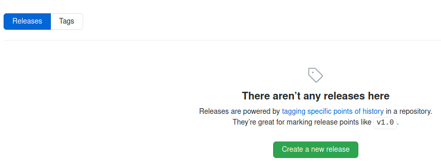

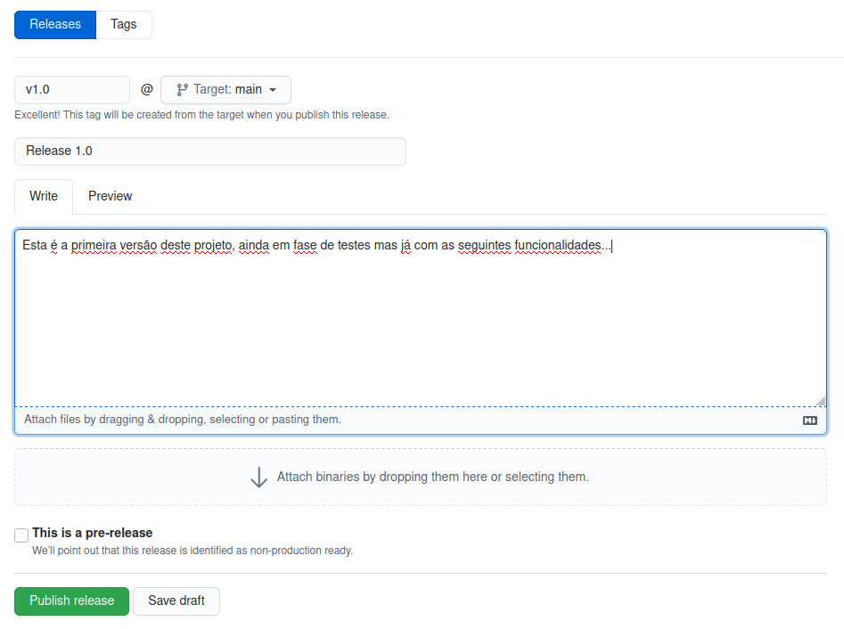

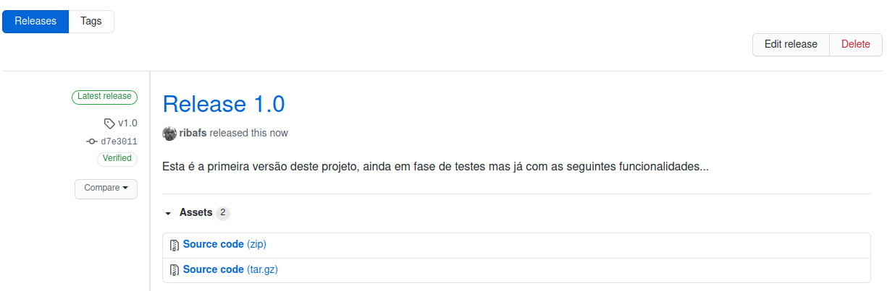

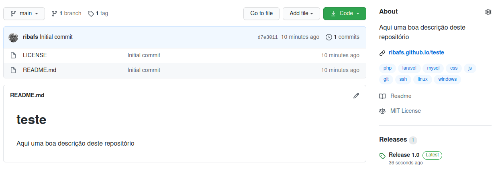


## Excluindo um repositório

- Abra o repositório
- Role a tela até o final
- Clique em Delete this repository
- Entre com seu login seguido da barra e o nome do repositório. Exemplo:

ribafs/teste

E clique em I understund ...


## Criando o composer.json com o composer

Abra no seu desktop o diretório do projeto que você clonou

Pelo terminal/prompt digite
```bash
composer init
```
Package name (digite ou apenas tecle enter para aceitar) - ribafs/teste

Description []: Uma descrição bem detalhada do projeto

Author: [Ribamar FS <ribafs@gmail.com>]

Minimum Stability []: dev ou stable (veja detalhes no site do composer)

Package Type: project

License []: MIT

Define your dependencies.

Would you like to define your dependencies (require) interactively [yes]? - no

Would you like to define your dev dependencies (require-dev) interactively [yes]? - no

{
    "name": "ribafs/teste",
    "description": "Uma descrição bem detalhada do projeto",
    "type": "project",
    "license": "MIT",
    "authors": [
        {
            "name": "Ribamar FS",
            "email": "ribafs@gmail.com"
        }
    ],
    "minimum-stability": "dev",
    "require": {}
}

Do you confirm generation [yes]? Enter

Com isso ele criou o composer.json.

Agora o enviamos para nosso repositório.


### Publicando seu projeto no Packagist

Depois de criar seu repositório e criar um release para ele então é o momento de publicar no Packagist, para que então se possa instalar através do composer.

Para publicar no Packagist nosso repositório precisa ter um composer.json e com toda a sintaxe correta, caso contrário ele irá recusar.

Acesse o site do packagist

https://packagist.org

- Faça seu cadastro clicando em Create account, depois faça login.
- Clique em Submit
- Copie o endereço do seu repositório no GitHub, exemplo:
- https://github.com/ribafs/teste
- E cole na caixa do Packagist
- Então clique em Check
- Depois clique em Submit

Se tudo correu bem seu repositório está publicado e agora pode ser instalado por qualquer um via linha de comando assim:

composer require ribafs/teste

Mas quando você fizer alterações nele, criar um novo release, o packagist não saberá. Precisamor sincronizar as alterações entre GitHub e Packagist

### Atualizações automáticas

Sempre que publicar um repositório no Packagist ele te avisará que precisa fazder isso e te mostra um link coom instruções:

https://packagist.org/about#how-to-update-packages

    Payload URL: https://packagist.org/api/github?username=ribafs
    Content Type: application/json
    Secret: your Packagist API Token (https://packagist.org/profile/)
    Which events? Just the push event is enough.


- Abra o seu repositório no GH
- Clique em Settings
- Clique em Webhooks
- Clique em Add webhook
- Em Payload URL: https://packagist.org/api/github?username=ribafs
- Content type: application/json
- Secret:
    - Colte ao site do packagist https://packagist.org/profile/
    - Clique em Show API token
    - Tecle Ctrl+C
    - Volte ao seu repositório no GH
    - Tecle Ctrl+V na caixa Secret
- Role a tela e clique em Add webohook

Agora suas alterações no repositório do GH serão recebidas imediatamente pelo Packagist.

Parece que funciona assim:
- O GitHub se comunica com o Packagist
- P packagist se comunica com o Composer

Para editar ou remover um pacote do Packagist:
- Faça login
- Selecione o pacote em My packages
- Clique no botão desejado


## Instalando seus projetos com o composer

Para instalar um apcote registrado no packagist fazemos:

composer require vendor/package

Para remover o pacote

composer remove vendor/package

Para sempre instalar a últiam versão de um pacote, inclusive as modificações que ainda não foram para release:

composer require vendor/package:dev-master

Para instalar uma versão específica:

composer require vendor/package:1.1

Para atualizar um pacote

Basta executar novamente

composer require vendor/package

Detalhes em:

https://getcomposer.org/doc/


## Outros recursos do GitHub

Outros bons recursos:

- Issues - onde podemos entrar em contato com o autor do projeto para indicar bugs e até para elogiar e outros
- Pull requests - esta é onde podemmos sugerir novos recursos para o projeto, já indicando o código
- Wiki - Usado para documentar o projeto. Muito prático. Conta com um editor com bons recursos.
- GitHub Pages - Cada repositório pode criar um site para si, tanto no  branch master quanto na pasta docs.


Espero que te seja útil. :)

Ribamar FS
